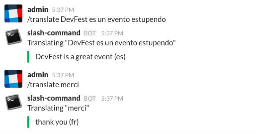

# `/translate` command for Slack



This is a small Slack application to be deployed on Google App Engine. It
offers a simple `/translate` command to translate phrases into english.

It was initially developed for a talk on DevFest London in 2016.

## Requirements

1. Install [Go][go].
2. Install the [Go App Engine SDK][sdk].

## Deploying and installing the application

1. Create a project on [Google Cloud][gcp-console] and save the project ID.
2. Create an [API Key for Google Translate][translate] and save it.
3. Create a [Slash Command integration in Slack][slack] and pointing to
  `https://[ YOUR PROJECT ID].appspot.com` and save the token.
4. Deploy the application

```sh
# Download the app's code
$ go get github.com/ernesto-jimenez/devfest-london-2016

# Deploy your app
$ appcfg.py update \
    --application [ YOUR PROJECT ID ] \
    -E TOKEN:[ YOUR SLACK TOKEN ] \
    -E :[ YOUR TOKEN ] \
    app.yaml
```

You are ready to go.

[go]: https://golang.org/dl/
[sdk]: https://cloud.google.com/appengine/downloads
[gcp-console]: https://console.cloud.google.com/
[translate]: https://cloud.google.com/translate/v2/quickstart
[slack]: https://my.slack.com/apps/build/custom-integration
